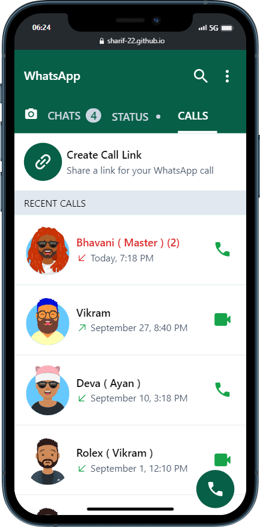

# WhatsApp UI Challenge

## Table of Contents

- [Project Title](#project-title)
- [Description](#description)
- [Demo](#demo)
- [Internship](#internship)
- [Technologies Used](#technologies-used)
- [License](#license)
- [Acknowledgments](#acknowledgments)

## Description

I recreate WhatsApp's UI using HTML and Tailwind CSS!

## Demo

[ Live preview](https://sharif-22.github.io/whatsapp-ui-using-tailwindcss/index.html)

### Home page

### chat page

### status page

### calls page

[ Live preview](https://sharif-22.github.io/whatsapp-ui-using-tailwindcss/index.html)

## Internship

This internship is provided by [CyberDude Networks Pvt. Ltd.](https://youtube.com/cyberdudenetworks) as part of the 6-Month Free Internship program, a skill development initiative organized to enhance participants' skills. Mentoring was provided by [Mr. Anbuselvan Rocky](https://instagram.com/anbuselvanrocky). For more information, [you can contact CyberDude Networks here](https://cyberdudenetworks.com).

## Technologies Used

<ol>
    <li> Tailwind CSS
    </li>
    <li> HTML
    </li>
</ol>

## License

[MIT](./LICENCE.md)

## Acknowledgments

I used icons from [icones](https://icones.js.org/), Created Avatar from [getavataaars](https://getavataaars.com/) and Background Image from [pxfuel](https://www.pxfuel.com/)

I'm inspired by the scroll feature from

<a href="https://github.com/mshajid" target="_blank">

Shajid Shafee

</a>
